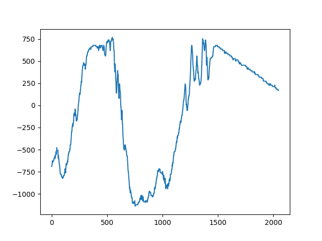
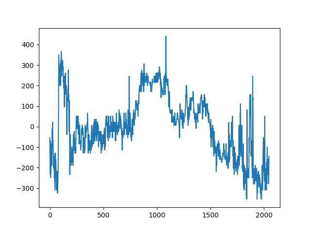

# Images are signals!
And henceforth, sound!

## Current scheme:
### Instrument
Sampled rows -> tambre (waveform)
Sampled columns -> envelope

### Note
HSV Color clustering
H -> [Pitch](https://www.flutopedia.com/sound_color.htm)
S or V -> velocity

Perhaps have random selection for notes from the image? (So I don't really have to compose haha)

### Chords underneath
Find a chord progression from the note pool or something
