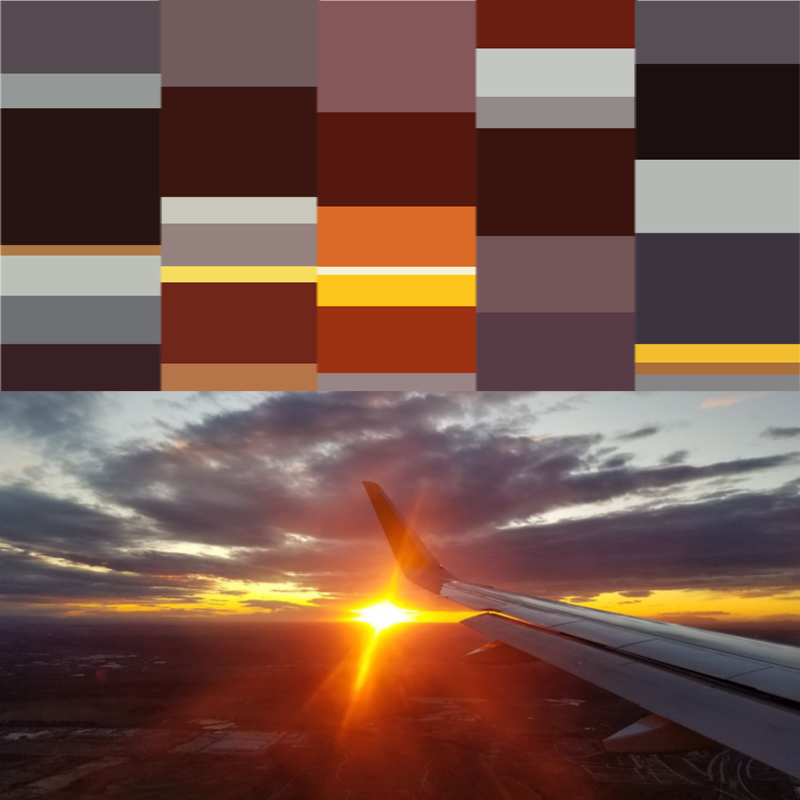

# Images are signals!
And henceforth, sound!

Scheme for my 21M.380 Final Project: Musical Pictures  
Tools to generate a 3:30 minute composition given a photograph  

## Current scheme (4/7/2020)
### Sections of the piece
The composition, and the image, will be divided into n sections, in order to encourage diversity throughout the piece. In order to create a MusicalPicture, just construct a MusicalPicture object with 2 parameters:  
    MusicalPicture("<filename>.png/.jpg/.bmp", number_of_sections)

These slices will be vertical (they will divide the width of the image), and are intended to be performed from left to right, although they can be performed in any order.

Each section of the piece will pull from its own pool of pitches, note durations, and velocities, and will have its own synthesizer instrument.

The information for each section can be written to a .txt file that is formatted as an odot bundle in order to easily be copied into Max/MSP.

### Instruments
A one dimentional row of information, or a 1D signal, can be generated in many ways from an image. For example, any cross section of the image can be viewed as a 1D signal: 

 

Examples of wave forms from the 50th and 1000th rows of an image, respectively (notice how they can be very different?)

For the composition, I plan to average the pixels across the columns of a section (converted to grayscale) in order to create a 1D signal. There is a tool included, ```MusicalPicture.generate_single_wav```, that will create 1 period of a signal from the section and save it as a .wav file. This file can be imported into Max/MSP and used as a custom wave form in the cycle~ object.

### Notes
#### Pitch

Each section will pull from a default of 7 pitches representing the 7 most dominant hues in the section of the image. I found the most dominant colors in the HSV colorspace by using [K-Means Clustering](https://www.pyimagesearch.com/2014/05/26/opencv-python-k-means-color-clustering/).



Example of the most dominant colors from each section of an image

Now that the colors are extracted, they need to be converted into pitches (in Hz). Using inspiration from [this article](https://www.flutopedia.com/sound_color.htm), the tool finds the closest western chromatic pitch associated with the hue of the color, and scales it up by an octave given how saturated the color is.

The tool will also generate the frequency at which the colors appear, which will be fed into o.random.weighted in order to pick pitches from colors that are more dominant more frequently.

### Chords underneath
Find a chord progression from the note pool or something
