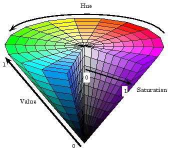

# "Musical Pictures"
*Andy Lambert - 21M.380*

For my final project, I decided to explore the pure sonification of a photograph. While sound is a one dimentional signal, pictures can be represented in 2 or three dimensions, depending on the type of co
lor data available. Working with a colored image, I had many degrees of freedom on how I chose to sonify each component. Therefore, the further I went, the more I realized that a "pure" sonification does
not really exist, when trying to manipulate data in this way. However, I did try to limit my creative decisions to be focused around the image data.            

## Scheme
The general scheme for the project changed over time, but eventually settled to focusing on a few aspects of the image. Firstly, the image is divided into 5 vertical strips (although this can be any number, I decided on 5). Each section of the image represents a section of the piece, read from left to right. To compose a 3.5 minute piece, I specified each section to represent 42 seconds each. There are two main areas of data I extractd from each section:

### Instruments
The main synthesizer I used was generated by using a custom waveform in the cycle~ object. This custom waveform was generated directly from the shape of the data. Using python, I converted the image secti
ons into grayscale, meaning that each pixel only has one value. I then averaged the grayscale values along the rows, so the result was a 1D array of numbers (example shown below). These numbers represented a wave shape that I
could save as a .wav file and import into MAX. The difference in the tambre of the synthesizers from section to section are suble, but can definitely be heard, which was exciting.

### Note Information
Once the instruments were designed, I decided to structure the melody of the piece by choosing from a random pool of pitches and durations. The pool was chosen from the segments of images, by looking at t
he color information in each segment. I started by finding the 7 most frequently appearing colors in the segment, using "k-means clustering" in python (shown below is the color palettes associated with each segment). Instead of leaving the colors encoded as RGB, I transformed them into the Hue Saturation Value colorspace (displayed below), which I thought would be more useful. 
 

I wanted the hue to inspire the picthes that were used, so I converted them to notes on the western chromatic scale that hold the same frequency as the color, but ~40 octaves down! It was really interesting researching various ways to associate colors and sound, but this way seemed the most straightforward.

I used the "value" information (or basically, how dark the colors were) to generate the durations. This meant that brighter sections would have more quickly changing notes, which you can notice around the
 middle of the piece, where there is the bright sun in the center. The notes move faster, and I also increased the volume when the overall brightness of the section was higher.

The "saturation" information (or how grey a color is) was only used to increase pitches by an octave if the colors were more saturated. This was simply to add a bit more range to the pool of pitches. All of the color data I exported to a text file I could copy and paste into an odot bundle, and I did most of the conversions using odot scripting.

### Randomness
The second major topic from the class I decided to implement was randomness. Once the pool of notes was generated, I used the frequency with which the colors appear in order to use a weighted random selec
tor to choose which note would play and for how long. For example, if there is a lot of red in one segement of the image, you would hear the pitch F more frequently than the other notes in the pool. If it
 was a darker red, the note durations would often be much longer.

### Underlying drone
In order to add more texture, I cycled through the pool of pitches in each segment, dropped them down by 2 octaves, and fed them into a droning synthesizer that played underneath the melody. This made the
 piece much easier to listen to, and I ended up liking the result enough to keep it in the piece.

## Conclusion
### Thoughts on the Result
When I started this project, I had no idea what the final result would sound like, and I let the image shape the result for the most part. I did not expect for the result to resemble an "aesthetic" representation of the image. In fact, the piece sounds almost very sinister and creepy, whereas the picture looks quite happy and hopeful! What I would try to demonstrate with this piece is that data does not always represent the beauty in something. However, there are infinitely other ways I could have sonified the image that might have resulted in a less dissonant result, this was just how my manipulation of the parameters worked out.

### Future Improvements
Having had more time, I would have tried to find a way to make the sections of the image less discrete and more continuous. Then the piece would progress without the listener really realizing the changes happening until perhaps the end, when the tone becomes much different. I would also have liked to tie the note envelopes to the photo information as well, so that there is more variety in the note shape.
I would also love to run my code on lots of other images, especially ones with more variety of colors. It would be really interesting to see what sorts of musical moods could be created from different typ
es of images, and what patterns I notice.

